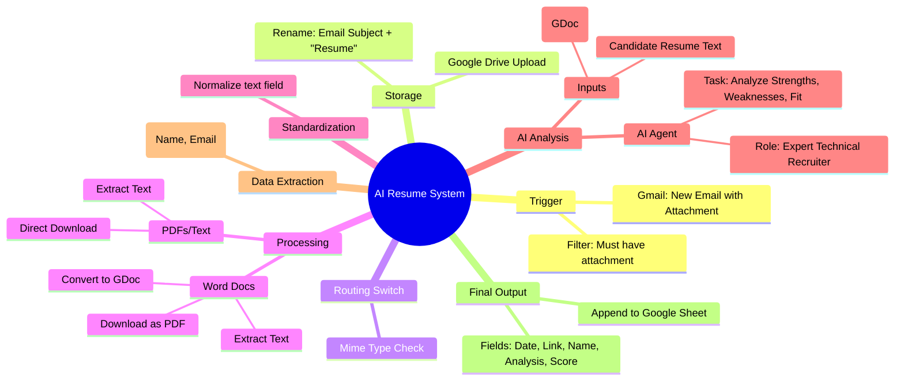
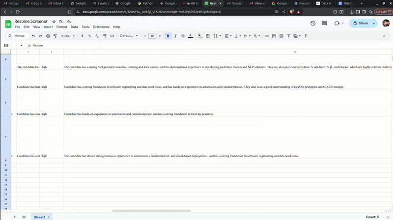

# 🤖 Smart AI Resume Analysis System

A comprehensive, automated system built with **n8n** that acts as an expert technical recruiter. It automatically triggers on new emails, processes resumes in various formats (PDF, Word, Text), analyzes them against a job description using AI, and outputs a structured report to Google Sheets.

## 🧠 System Mind Map

> [!NOTE]
> This mind map visualizes the logic flow from email trigger to final analysis.

## 🚀 Workflow Breakdown

> [!TIP]
> Want to see how we built this? Check out **[The Journey: Zero to Hero](journey.md)** for the implementation guide, Docker setup, and troubleshooting tips!

The process moves from manual planning to automated execution. Here is the step-by-step breakdown:

### 1. The Planning Phase 📝
Before building, we listed every step performed manually and wireframed the logic. This "instruction manual" ensures we know exactly where data transforms and where AI enters the loop.

### 2. Trigger & Initial Storage 📧
*   **Trigger**: The workflow listens for a **Gmail** trigger (new messages with attachments). ensuring "download attachments" is enabled to get the binary data.
*   **Storage**: Resumes are uploaded to a specific **Google Drive** folder and automatically renamed for consistency.

### 3. File Type Routing (The Switch Node) 🔀
Since resumes come in different formats, a **Switch node** routes them based on "mime type":
*   **Word Documents (.docx)**: Converted to Google Docs via API, then downloaded as PDF for text extraction.
*   **PDFs & Text Files**: Downloaded directly and processed by an extraction node.

### 4. Data Standardization ⚖️
To ensure the AI receives consistent input, all extraction branches merge into a single node that standardizes the content into a common field (e.g., `text`).

### 5. AI Analysis & Reasoning 🤖
*   **Context**: The system downloads the **Job Description** from a separate Google Doc.
*   **The AI Agent**: Configured as an "expert technical recruiter," it receives both the resume and the JD.
*   **Analysis**: It evaluates strengths, weaknesses, risks, and an overall fit rating.
*   **Structured Output**: A parser ensures the AI returns specific data fields (JSON) instead of unstructured text.

### 6. Information Extraction & Export 📊
*   **Contact Info**: A specialized AI node extracts the candidate's Name and Email.
*   **Google Sheets**: The final data—Date, Resume Link, Contact Info, and the detailed AI Analysis—is appended as a new row in your tracking sheet.

## 🛠️ Setup & Prerequisites

### Prerequisites
*   Self-hosted or Cloud **n8n** instance.
*   **Google Cloud Console** project with credentials for:
    *   Gmail API
    *   Google Drive API
    *   Google Sheets API
*   **LLM Provider** (OpenAI, Anthropic, or Ollama for local) configured in n8n.

## 🌍 How to Import & Use (Any Platform)

This workflow is portable and can be imported into any **n8n** environment, whether you are using **n8n Cloud**, **Self-Hosted (Docker/npm)**, or the **Desktop app**.

### Step 1: Get the Workflow File
1.  Download the **`HR Screening Auntomation.json`** file from this repository.
2.  *Alternatively*, copy the raw JSON content if you prefer pasting it directly.

### Step 2: Import into n8n
1.  Open your **n8n** dashboard.
2.  Create a **New Workflow**.
3.  Click the **three dots (...)** in the top-right corner of the canvas.
4.  Select **Import from file** and choose the JSON file you downloaded.
    *   *(Or select "Import from URL" if viewing the raw file on GitHub).*
5.  The entire workflow will appear on your canvas!

### Step 3: Configure Your Credentials
Once imported, you will need to reconnect the nodes to your own accounts:
*   **Gmail Node**: Select 'Credential for OAuth2' and authenticate with your Google account.
*   **Google Drive Nodes**: Select your Google Drive credentials.
*   **Google Sheets Node**: Select your Google Sheets credentials.
*   **AI Model**: Click on the AI Agent/Model node and select your preferred LLM credential (e.g., OpenAI API Key, Anthropic, or local Ollama).

### Step 4: Set Up Resources
To make the workflow run successfully, update these specific fields:
1.  **Drive Folder**: Create a folder in Google Drive for resumes and paste its ID into the *Upload file* node.
2.  **Job Description**: Create a Google Doc with your JD and paste its ID into the *Download Job Description* node.
3.  **Tracking Sheet**: Create a Google Sheet with headers (`Date`, `Resume Link`, `Name`, `Email`, `Analysis`, etc.) and paste its ID into the *Append to Sheet* node.

### Step 5: Activate! 🚀
*   Toggle the workflow to **Active** in the top-right corner.
*   Send a test email with a resume attached to verify it triggers correctly.

## 📄 License
This project is open-source. Feel free to modify and adapt it for your hiring pipeline!
